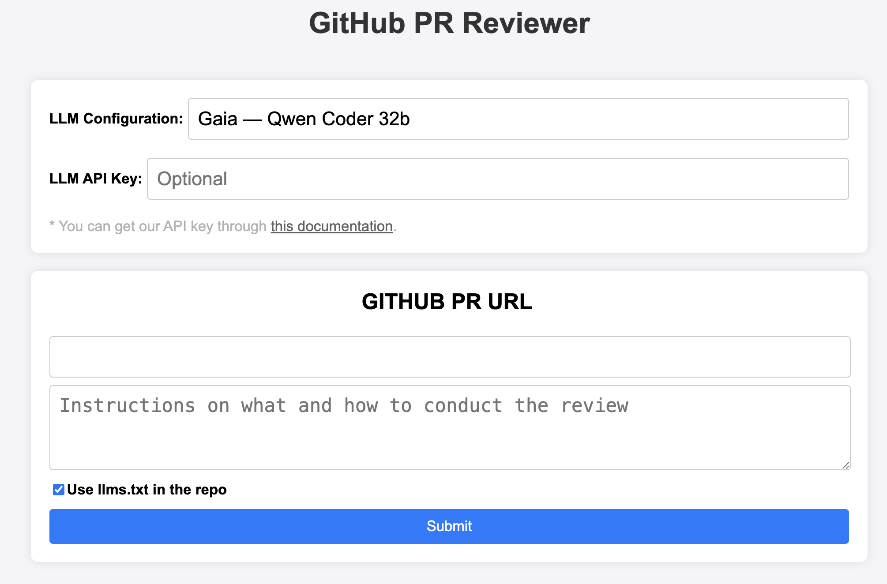
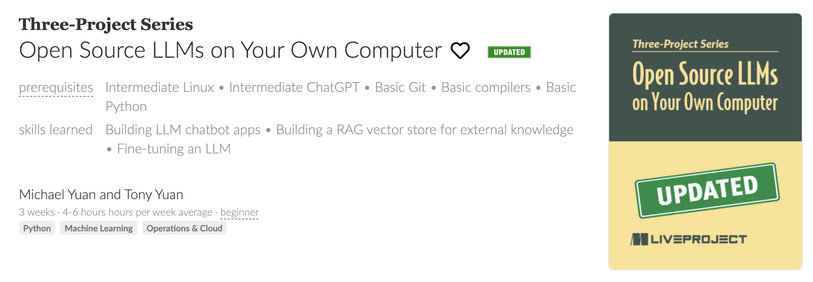

# Build a private AI coding assistant

> Workshop @ Wasm.io 2025

## Try a PR review agent built on WasmEdge

https://lowcoderust.com/

https://code.flows.network/webhook/IdDl5jrutZEAguuMPsS5



## Demo

Uses `llms.txt` for overall context.

Review specific prompt: "This is designed to run in the WasmEdge sandbox."

Review: https://github.com/second-state/microservice-rust-mysql/pull/24

Video: https://drive.google.com/file/d/1MfDGU8Pc4abHMLUz6SfY5G6P42gk4qG9/view?usp=drivesdk

## Read a book

https://www.manning.com/liveprojectseries/open-source-llms-on-your-own-computer



## Why private / local LLM?

* Code is private
  * Use private data for context
  * Use private tools for validation
* Customized LLMs for each doing task!
* AGI requires "the brian" on the edge

The "small LLM" thesis: https://x.com/juntao/status/1828474514801328637

## Run an LLM locally

Start a server: https://github.com/GaiaNet-AI/node-configs/tree/main/qwen2.5-0.5b-instruct

Local access: http://localhost:8080/chatbot-ui/index.html

Q: Write a hello world in Python

Q: Create a Rust web server that takes JSON in HTTP request body and returns a CSV in the HTTP response

## Coding LLMs

Qwen Coder: https://github.com/QwenLM/Qwen2.5-Coder
LlamaEdge / Gaia: https://huggingface.co/gaianet/Qwen2.5-Coder-32B-Instruct-GGUF

Codestral: https://mistral.ai/news/codestral-2501
LlamaEdge / Gaia: https://huggingface.co/gaianet/Codestral-22B-v0.1-GGUF

Tessa: https://huggingface.co/Tesslate/Tessa-T1-32B
LlamaEdge / Gaia: https://huggingface.co/gaianet/Tessa-T1-32B-GGUF

Gemma? 
* https://x.com/realwasmedge/status/1904199412793987519
* https://medium.com/@michaelyuan_88928/gemma-3-as-a-coding-assistant-f044a204dce9

## Run a coding LLM locally!

Start from fresh: https://github.com/GaiaNet-AI/node-configs/tree/main/qwen-2.5-coder-0.5b-instruct

Replace the LLM and restart the server. **Remeber to stop the previous server!**

```
gaianet init --config https://raw.githubusercontent.com/GaiaNet-AI/node-configs/main/qwen-2.5-coder-0.5b-instruct/config.json

gaianet stop
gaianet start
```

> NOTE: You can reduce the `ctx-size` in `config.json` if it fails to start due to low memory.

Q: Write a hello world in Python

Q: Create a Rust web server that takes JSON in HTTP request body and returns a CSV in the HTTP response

## Why Wasm (or WasmEdge)?

* Much simpler and lighter compared with Python
* Safer and and much easier to customize compared with C/C++
* Lightweight abstraction
  * Portable across hardware and GPU architectures
  * Portable across OSes and GPU drivers
  * Support all leading GenAI models

https://blog.stackademic.com/why-did-elon-musk-say-that-rust-is-the-language-of-agi-eb36303ce341

https://x.com/juntao/status/1848808434709500157

## Introduction to LlamaEdge

https://llamaedge.com/docs/intro

https://llamaedge.com/docs/user-guide/

## Rust is great for coding LLMs!

A video interview from Bret Taylor: https://www.youtube.com/watch?v=2KhWDKCNNvk

## Teach the LLM Rust!

* Finetuning: Helps with style / language but not knowledge
* RAG: Too fragmented for coding, which requires long context length
* Contexual search

## How it works?

https://huggingface.co/datasets/gaianet/learn-rust

Learn more from a LlamaEdge generated podcast: https://youtu.be/-6e4xp-oFcA

Courtesy LFX mentorship for funding and support: https://github.com/WasmEdge/WasmEdge/issues/3495 

Created by: https://github.com/codemaster1104

## Try it!

DYI

* https://github.com/GaiaNet-AI/node-configs/tree/main/qwen-2.5-coder-7b-instruct_rustlang
* https://github.com/GaiaNet-AI/node-configs/tree/main/qwen-2.5-coder-32b-instruct_rustlang

Hosted on https://lowcoderust.com/

* https://llamaedge.github.io/chatbot-ui/index?api_url=https://rustcoder.gaia.domains

## Put it into your IDE

https://x.com/juntao/status/1839701777978896854

Cursor: https://docs.gaianet.ai/agent-integrations/cursor

Zed: https://docs.gaianet.ai/agent-integrations/zed

## Examples

https://x.com/realwasmedge/status/1856426331187360118

## What's next?

* Generate coding artifacts instead of snippets
* Run compiler tools on generated artifacts
  * MCP! https://mcp.run
* Scale the inference-time compute

Contribute and keep track of progress (funded by Linux Foundation): 
https://github.com/WasmEdge/WasmEdge/issues/4038


